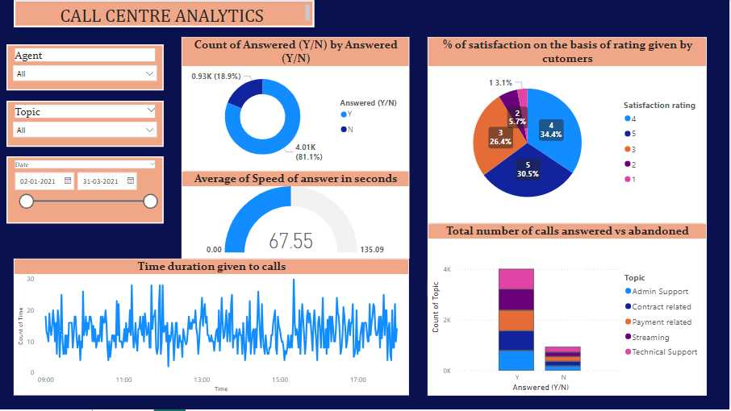

# **PowerBI-Call-center-data-analysis**

## **Objective:**

The objective of this case study is to analyze the dataset and extract the information about the call centre data highlighting the key performance indicators(KPIs).

## **Tool Used:**

PowerBI Desktop

## **DataSet:**

The dataset was provided in the form of an excel sheet which contained the following columns:
- CallID
- Agent
- Date
- Time
- Topic
- Answered
- Resolved
- Speed of answer
- Avg Talk Duration
- Satisfactory rating

## Overall analysis view:

## **Dashboard Overview:**

The analysis gives a breif overview of long term trend in cutomer-agent behaviour. The Power BI dashboard provides visualizations and insights into the following aspects:
- **Call Volume**: Analysis of the number of calls over time.
- **Agent Performance**: Performance metrics for individual agents.
- **Customer Satisfaction**: Trends in customer satisfaction scores.
- **Resolution Efficiency**: Efficiency metrics for resolving customer issues.

